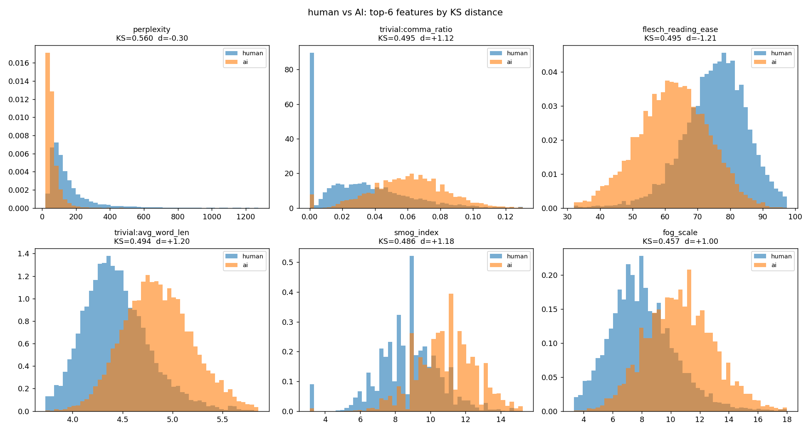
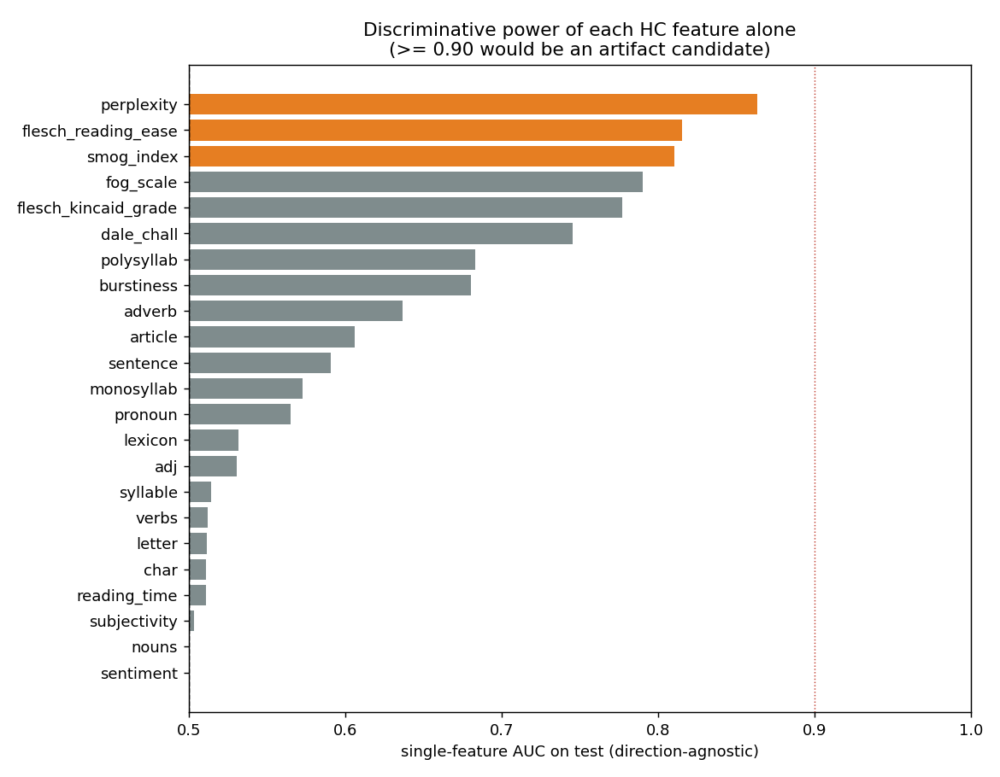

# 누수감사 — 상세

> 이 문서는 [README](../README.md)에서 분리한 상세 분석입니다. 요약은 README를 보세요.

## 누수 감사 — F1 0.98은 어디에서 오는가

AI 생성 텍스트 탐지에서 F1 0.98대는 정상적인 수치가 아닙니다. 이런 값이 나오면 모델이 의미를 판별한 것이 아니라
**LLM 재작성이 데이터셋에 남긴 표층 단서**(길이 분포, 구두점 빈도, 어휘 다양성, 정형 도입부)를 잡고 있을 가능성을 먼저 배제해야 합니다.
그래서 학습 파이프라인과 완전히 독립된 감사 스크립트를 따로 두고, 주 실험과 **동일한 test set**(stratified 70/15/15, `seed=42`, N=3,000) 위에서 측정했습니다.

```bash
make audit     # = python analysis/leakage_audit.py --data data/data_yelp.parquet
```

전체 수치는 `analysis/leakage_results.json`, 그림은 `docs/images/audit_*.png` 에 있습니다. GPU 없이 CPU 수 분이면 끝납니다.
아래 수치는 전부 **실행해서 얻은 값**이며, 추정치는 없습니다.

### 1. 사소한 베이스라인 — 원문 문자열만으로 F1 0.8867

HC 피처도, GPT-2도, 트랜스포머도 쓰지 않고 **파이썬 문자열 연산만으로** 뽑은 표층 피처 11개
(문자 수, 단어 수, 구두점 비율, 쉼표·마침표 비율, 느낌표 수, 대문자 비율, 숫자 비율, 평균 단어 길이, type-token ratio, 줄바꿈 수)로 분류기를 돌린 결과입니다.

| 입력 | LogisticRegression F1 / AUC | HistGradientBoosting F1 / AUC |
|------|------|------|
| `char_len` 하나 | 0.5509 / 0.4968 | 0.6547 / 0.6276 |
| `word_count` 하나 | 0.5769 / 0.5321 | 0.6447 / 0.6152 |
| `punct_ratio` 하나 | 0.5556 / 0.5248 | 0.6659 / 0.6314 |
| 길이 + 단어수 + 구두점 (3개) | 0.7464 / 0.8296 | 0.7784 / 0.8631 |
| **표층 11개 전체** | 0.8619 / 0.9302 | **0.8867 / 0.9513** |

**표층 통계 11개만으로 F1 0.8867.** 같은 감사에서 재현한 HC 23개 전체 MLP가 F1 0.9114(AUC 0.9735)이므로,
README가 보고한 HC-only F1 0.9220의 **대부분은 GPT-2 perplexity가 없어도 도달 가능한 수준**입니다.

### 2. 길이는 범인이 아니었다 — 진짜 단서는 어휘·구두점 스타일

가장 흔한 의심인 길이 누수는 이 데이터셋에서는 **기각**됩니다.

- `char_len` 단독 AUC **0.5032** (사실상 무작위). 원 데이터 구축 시 길이를 맞춘 것으로 보입니다.
- `char_len` 5%-분위 20구간 안에서 human/ai 수를 동일하게 맞춘 length-matched 부분집합(N=15,644, 7,822 대 7,822)에서
  길이 단독 AUC는 0.5100으로 떨어지지만, **HC 전체 성능은 F1 0.9056 → 0.9003 으로 거의 그대로**입니다.
- 길이 계열 피처 8개(`char`·`letter`·`syllable`·`lexicon`·`sentence`·`polysyllab`·`monosyllab`·`reading_time`)를 아예 빼도 F1 0.8848 / AUC 0.9511.

대신 실제로 판별력을 만드는 표층 단서는 **문체 지문**입니다 (단일 피처 AUC, test):

| 표층 피처 | AUC | human 평균 | AI 평균 |
|---|---|---|---|
| 평균 단어 길이 | 0.8122 | 4.43 | 4.86 |
| 쉼표 비율(단어당) | 0.7914 | 0.03 | 0.06 |
| 대문자 비율 | 0.7568 | 0.03 | 0.02 |
| 느낌표 개수 | 0.6699 | 0.90 | 0.05 |

느낌표가 특히 노골적입니다 — 사람 리뷰는 평균 0.90개, LLM 재작성본은 0.05개입니다.



### 3. 단일 피처 판별력 — 0.9를 넘는 단일 아티팩트는 없음

HC 23개를 **하나씩** 단독으로 썼을 때의 test AUC 상위 5개입니다. 0.9 이상은 없으므로 "피처 하나가 라벨을 그대로 들고 있는" 형태의 누수는 아닙니다.

| 순위 | 피처 | 단독 AUC | 단독 LR F1 |
|---|---|---|---|
| 1 | `perplexity` | 0.8635 | 0.7847 |
| 2 | `flesch_reading_ease` | 0.8154 | 0.7313 |
| 3 | `smog_index` | 0.8102 | 0.7400 |
| 4 | `fog_scale` | 0.7900 | 0.7085 |
| 5 | `flesch_kincaid_grade` | 0.7771 | 0.7053 |



### 4. HC-only 0.9220은 사실상 perplexity 하나

HistGradientBoosting permutation importance(AUC 감소, n_repeats=10)와 그룹 ablation(LogisticRegression) 결과입니다.

| permutation importance 상위 | AUC 감소 |
|---|---|
| `perplexity` | **+0.2109** ±0.0064 |
| `monosyllab` | +0.0487 ±0.0016 |
| `article` | +0.0435 ±0.0019 |
| `flesch_reading_ease` | +0.0383 ±0.0017 |
| `adverb` | +0.0127 ±0.0010 |
| `burstiness` | +0.0123 ±0.0009 |

| 그룹 ablation (F1 / AUC) | 그 그룹만 | 그 그룹 제외 |
|---|---|---|
| count(7) | 0.7589 / 0.8481 | 0.8851 / 0.9522 |
| readability(6) | 0.7441 / 0.8357 | 0.9013 / 0.9608 |
| sentiment(2) | 0.5322 / 0.4947 | 0.9009 / 0.9623 |
| **LM(2) — perplexity·burstiness** | 0.7929 / 0.8684 | **0.8532 / 0.9303** |
| POS(6) | 0.7191 / 0.7884 | 0.8684 / 0.9404 |

HC 23개 전체 LR이 0.9056인데 LM 2개만 빼면 0.8532로, 다른 어느 그룹을 빼는 것보다 낙폭이 큽니다.
다만 그 안에서도 기여는 `perplexity`에 몰려 있고 **`burstiness` 단독 기여는 +0.0123으로 작습니다.**
위 [실험 결과](실험결과_상세.md)의 "`perplexity`·`burstiness` 같은 LM 기반 통계가 강한 판별력을 갖는다"는 서술은 `perplexity`에 한해 맞고, `burstiness`에 대해서는 과대평가였습니다.
한편 `sentiment`/`subjectivity` 2개는 단독 AUC 0.4947로 **정보가 사실상 없습니다.**

### 5. 가장 아픈 결과 — bag-of-words가 F1 0.9744

텍스트 쪽을 점검하면서 TF-IDF(word 1–2gram, `min_df=3`, 65,495차원) + LogisticRegression을 같은 split에서 돌렸습니다.

| 모델 | F1 | AUROC | test 3,000건 중 오분류 |
|---|---|---|---|
| **TF-IDF + LogisticRegression** | **0.9744** | 0.9964 | 약 76건 |
| ② HC + RoBERTa Cross-Attention (README) | 0.9832 | 0.9989 | 약 50건 |

**RoBERTa 임베딩과 이종 융합 구조 전체가 선형 bag-of-words 대비 추가로 얻은 것은 F1 +0.0088, 오분류 76건 → 50건입니다.**
즉 이 과제는 단어 빈도만으로 이미 97% 이상 풀리는 문제였고, 0.98이라는 숫자 자체는 모델의 우수성이 아니라 **과제의 쉬움**을 반영합니다.

### 6. 왜 bag-of-words로 풀리는가 — 정형 도입부

| 관측 | AI 10,000건 | human 10,000건 |
|---|---|---|
| 상위 10개 도입 5-gram이 덮는 비율 | **9.95%** | 0.74% |
| 고유 도입 5-gram 수 | 5,938 | 9,575 |
| 한쪽에만 쏠린 n-gram 수(한쪽 DF>1%, 반대쪽 <0.05%) | 116 | 39 |

AI 쪽 도입부는 특정 템플릿으로 수렴합니다 — `"I was really looking forward…"` 293건,
`"I stumbled upon this hidden…"` 159건, `"I stumbled upon this gem…"` 84건.
인간 리뷰의 최빈 도입부는 10건에 불과합니다.
어휘 수준에서도 `experience`(DF 0.094 → 0.470), `overall`(0.054 → 0.344), `atmosphere`(0.061 → 0.245)가 AI 쪽으로,
`very`(0.283 → 0.049), `will`(0.196 → 0.010), `so`(0.336 → 0.097)가 human 쪽으로 강하게 갈립니다.
**두 소형 모델의 프롬프트·디코딩 설정이 만든 정형성이 라벨을 거의 직접 알려주고 있습니다.**

### 7. 생성기가 바뀌면 무너진다

AI 라벨을 만든 두 모델 사이의 전이 성능을 측정했습니다. human 10K를 절반씩 나눠 한쪽 생성기로 학습하고 다른 생성기로 평가합니다.

| 조건 | HC 23개 LR (F1 / AUC) | TF-IDF LR (F1 / AUC) |
|---|---|---|
| in-generator Llama-3.2-1B | 0.9402 / 0.9856 | — |
| in-generator Qwen3-1.7B | 0.8820 / 0.9498 | — |
| Qwen3-1.7B 학습 → Llama-3.2-1B 평가 | 0.9105 / 0.9689 | 0.9352 / 0.9922 |
| **Llama-3.2-1B 학습 → Qwen3-1.7B 평가** | 0.8332 / 0.9274 | **0.7228 / 0.9679** |

TF-IDF는 같은 생성기 안에서 0.9744였다가 미학습 생성기에서 **F1 0.7228까지 떨어집니다.**
어휘 신호의 상당 부분이 일반적인 "AI 문체"가 아니라 **특정 생성기의 지문**이라는 직접 증거입니다.
HC 피처 쪽은 낙폭이 작아(0.9402 → 0.8332) 상대적으로 생성기에 덜 민감하지만, 절대 성능 자체가 낮습니다.

### 정리 — 0.9832의 분해

동일 test set 기준으로 쌓아 보면 이렇게 됩니다.

| 단계 | F1 | 이 단계가 새로 설명하는 몫 |
|---|---|---|
| 문자열 통계 11개 (GB) | 0.8867 | — |
| HC 23개 (본 감사 MLP 재현) | 0.9114 | +0.025 |
| TF-IDF bag-of-words + LR | 0.9744 | +0.063 |
| ② HC + RoBERTa Cross-Attention (README) | 0.9832 | **+0.009** |

**결론: F1 0.9832 중 실질적으로 융합 구조가 기여한 몫은 마지막 약 0.009입니다.**
나머지는 (a) LLM 재작성이 남긴 문체 지문, (b) 두 소형 생성기의 정형 도입부, (c) GPT-2 perplexity 한 개가 만들어냅니다.
**이 저장소의 가치는 탐지 성능 수치가 아니라, 이종 신호를 어느 지점에서 융합할지에 대한 통제된 대조 실험에 있습니다.**
표의 0.98대 숫자는 모델 품질이 아니라 **벤치마크의 난이도**를 읽는 값으로 취급해야 합니다.

### 실제 배포 환경에서 예상되는 성능

- **미학습 생성기**: 위 교차 실험 기준 F1 0.72~0.94. GPT-4급처럼 더 자연스럽고 프롬프트 다양성이 큰 생성기라면 이보다 낮을 가능성이 높습니다(미측정).
- **표층 단서를 통제한 재작성**: 길이·구두점·도입부를 human 분포에 맞추도록 지시하면 감사에서 확인된 신호 대부분이 사라집니다. 이 조건은 **아직 실측하지 않았습니다.**
- **도메인 이전**(레스토랑 리뷰 → 다른 도메인): `flesch_reading_ease` 같은 가독성 지표의 human 기준선 자체가 이동하므로, 재보정 없이는 성능 보장이 불가합니다. 역시 미측정입니다.
- 감사에서 측정한 범위 안에서는, **동일 생성기·동일 도메인이라는 조건이 깨지는 순간 F1이 0.9 아래로 내려가는 것이 기본 시나리오**로 보는 편이 안전합니다.

### 개선 경로

1. **표층 정규화 후 재평가** — 길이 매칭은 이미 적용했고(성능 유지), 다음은 구두점·대소문자·느낌표 빈도를 human 분포에 맞춰 정규화한 뒤 다시 측정.
2. **도입부 ablation** — 각 리뷰의 첫 1~2문장을 제거하고 재학습. 정형 도입부가 빠졌을 때 남는 성능이 "진짜 문체 탐지"의 상한선입니다.
3. **leave-one-generator-out 평가를 기본 지표로 승격** — in-generator 수치를 대표값으로 보고하지 않습니다.
4. **적대적 재작성 데이터 추가** — 표층 통계를 human 분포에 맞추도록 프롬프트한 생성물을 hard negative로 투입.
5. **bag-of-words를 상시 베이스라인으로 표에 포함** — 새 구조가 TF-IDF+LR을 유의미하게 넘지 못하면 그 구조는 기여가 없다고 판정.
